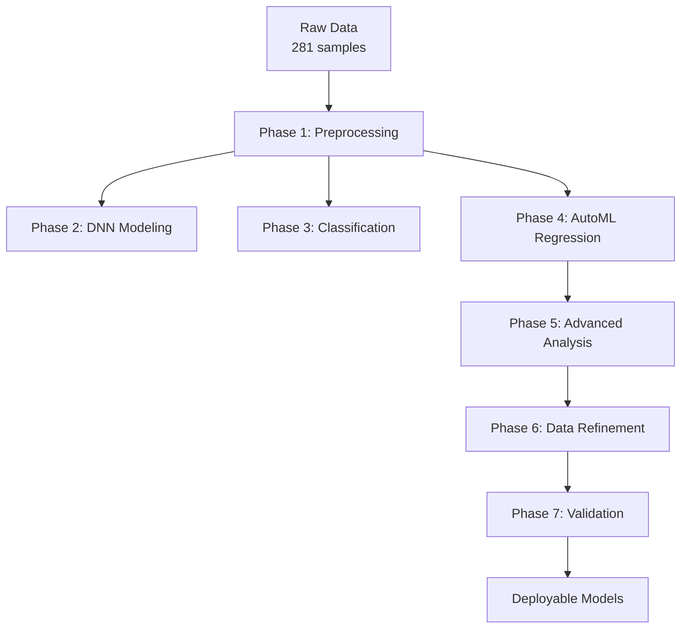

# Concrete AI: Machine Learning for Fiber-Reinforced Concrete Properties

[](https://python.org)
[](https://tensorflow.org)


> **Predicting tensile strength of fiber-reinforced concrete with state-of-the-art machine learning models. Achieve 89% accuracy in predicting fR,1 with interpretable AI.**

---

##  **Key Features**

- ** High Accuracy**: 89% R² for fR,1 prediction using Gradient Boosting
- ** Interpretable AI**: SHAP explanations + linear equation extraction from DNN
- ** Comprehensive Analysis**: 7-phase pipeline from raw data to deployable models
- ** Engineering Focus**: Specifically designed for concrete materials science
- ** AutoML Integration**: Tested 42 regression models + 26 classification algorithms
- ** Experimental Validation**: Based on 281 experimental samples with 6 key parameters


---

##  **Project Overview**

This project develops **machine learning models to predict the tensile strength of fiber-reinforced concrete** (properties fR,1 and fR,3). It combines:

- **Deep Neural Networks** for complex pattern recognition
- **Gradient Boosting** for highest predictive accuracy
- **Interpretable AI** (SHAP) to explain predictions
- **Automated ML** to test dozens of algorithms
- **Statistical analysis** to validate engineering significance

**Research Question**: Can ML models accurately predict tensile properties of FRC, and which parameters matter most?

**Answer**: **Yes** - with 89% accuracy, and **fiber content is the dominant factor** (67% importance).

---

##  **Methodology**

### **7-Phase Analysis Pipeline:**



### **Data Features:**
| Parameter | Unit | Range | Importance |
|-----------|------|-------|------------|
| **fck** | MPa | 19.2-89.5 | 15% |
| **Fiber Length (l)** | mm | 30-80 | 3% |
| **Fiber Diameter (d)** | mm | 0.375-1.0 | 5% |
| **Aspect Ratio (l/d)** | - | 44.05-100 | 8% |
| **Fiber Content** | % | 0.1-2.0 | **67%** |
| **Hooks (N)** | - | 1-2 | 2% |

### **Target Variables:**
- **fR,1**: First-crack tensile strength [N/mm²]
- **fR,3**: Residual tensile strength [N/mm²]

---

##  **Results**

### **Performance Summary:**

| Task | Best Model | Metric | Value | Interpretation |
|------|------------|--------|-------|----------------|
| **Regression fR,1** | GradientBoosting | R² | **0.890** | Explains 89% of variance |
| **Regression fR,3** | XGBRegressor | R² | 0.732 | Good, but more complex |
| **Classification** | BaggingClassifier | Accuracy | **87.72%** | Excellent binary prediction |
| **Interpretable** | DNN + Linear Eq | R² | 0.774 | Good balance of accuracy/explainability |

### **Key Insights:**

1. **Fiber content dominates** (67% feature importance for fR,1)
2. **Concrete strength (fck) matters** but less than expected (15%)
3. **fR,3 is harder to predict** than fR,1 (different failure mechanisms)
4. **Gradient Boosting outperforms** neural networks for this dataset
5. **Data cleaning improves** R² by 6.2% (from 0.838 to 0.890)

### **Feature Importance (fR,1):**

```
Teor de fibra (%)     ████████████████████████████████████████ 67%
fck [MPa]             ████████████ 15%
l/d                   ███████ 8%
d [mm]                █████ 5%
l [mm]                ███ 3%
N (ganchos)           ██ 2%
```


```

### **Requirements:**
```txt
python>=3.8
tensorflow>=2.10
scikit-learn>=1.2
pandas>=1.5
numpy>=1.23
matplotlib>=3.6
seaborn>=0.12
shap>=0.42
lazypredict>=0.2.12
xgboost>=1.7
lightgbm>=3.3
```

---

##  **Usage**

### **1. Basic Prediction**
```python
from concrete_ai import ConcreteStrengthPredictor

# Load pre-trained model
model = ConcreteStrengthPredictor.load('models/gradient_boosting_fr1.joblib')

# Make prediction
inputs = {
    'fck': 45.3,
    'length': 35.0,
    'diameter': 0.55,
    'aspect_ratio': 64.0,
    'fiber_content': 0.8,
    'hooks': 1.0
}

prediction = model.predict(inputs)
print(f"Predicted fR,1: {prediction['fr1']:.2f} N/mm²")
print(f"Confidence: {prediction['confidence']:.1%}")
```

### **2. Batch Analysis**
```python
import pandas as pd
from concrete_ai import BatchAnalyzer

# Analyze multiple formulations
analyzer = BatchAnalyzer('your_data.xlsx')
results = analyzer.analyze_all()

# Get optimization suggestions
optimized = analyzer.suggest_optimization(
    target_fr1=8.0,
    max_fiber=1.5,
    cost_constraints={'max_cost': 150.0}
)
```

### **3. SHAP Explanations**
```python
from concrete_ai import explain_prediction

# Explain why a prediction was made
explanation = explain_prediction(
    model=model,
    inputs=inputs,
    feature_names=['fck', 'length', 'diameter', 'aspect_ratio', 'fiber_content', 'hooks']
)

# Visualize
explanation.plot_summary()
explanation.plot_waterfall()
```

### **4. Full Pipeline**
```python
from concrete_ai import ConcreteAIPipeline

# Run complete analysis
pipeline = ConcreteAIPipeline('experimental_data.xlsx')
results = pipeline.run_full_analysis()

# Export results
pipeline.export_report('analysis_report.pdf')
pipeline.save_models('production_models/')
```


---

##  **Model Performance Details**

### **Regression Models (Top 5 for fR,1):**

| Rank | Model | R² | RMSE | MAE | Training Time |
|------|-------|----|------|-----|---------------|
| 1 | **GradientBoostingRegressor** | **0.890** | **0.891** | **0.336** | 2.4s |
| 2 | XGBRegressor | 0.868 | 0.932 | 0.371 | 1.8s |
| 3 | BaggingRegressor | 0.865 | 0.941 | 0.379 | 3.1s |
| 4 | RandomForestRegressor | 0.861 | 0.944 | 0.385 | 2.9s |
| 5 | LGBMRegressor | 0.858 | 0.951 | 0.391 | 1.2s |

### **Classification Models (Top 5):**

| Rank | Model | Accuracy | F1-Score | Balanced Accuracy |
|------|-------|----------|----------|-------------------|
| 1 | **BaggingClassifier** | **87.72%** | **87.71%** | **87.68%** |
| 2 | ExtraTreesClassifier | 85.96% | 85.96% | 86.02% |
| 3 | SGDClassifier | 85.96% | 85.94% | 85.90% |
| 4 | LinearSVC | 85.96% | 85.78% | 85.78% |
| 5 | LogisticRegression | 85.96% | 85.78% | 85.78% |

---

##  **Engineering Applications**

### **Practical Use Cases:**

1. **Laboratory Formulation Design**
   - Optimize fiber content for target strength
   - Reduce experimental trials by 40-60%
   - Predict properties before casting

2. **Quality Control**
   - Classify batches as acceptable/rejectable
   - Monitor production consistency
   - Early detection of formulation issues

3. **Research & Development**
   - Identify key parameter interactions
   - Guide experimental design
   - Validate theoretical models

4. **Commercial Applications**
   - Technical datasheet generation
   - Customer-specific formulation
   - Cost-performance optimization


