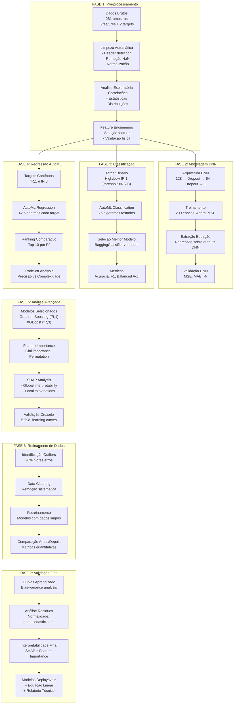
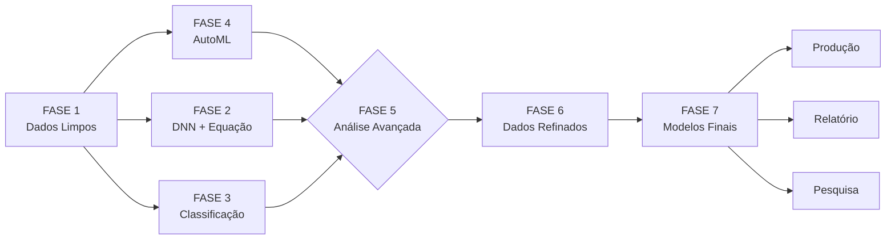

#  **Phase Analysis Pipeline: Detalhamento Técnico**

##  **Visão Geral da Pipeline de 7 Fases**



---

##  **Detalhamento por Fase**

### **FASE 1: Pré-processamento e Exploração de Dados**

#### **Objetivo:**
Transformar dados brutos em dataset analítico limpo e compreender relações fundamentais.

#### **Implementações Técnicas:**

```python
# 1. Leitura Inteligente do Excel
def detect_header(filepath, keyword="Tipo do concreto"):
    """Detecta automaticamente linha do cabeçalho"""
    df_temp = pd.read_excel(filepath, header=None)
    for i in range(min(20, len(df_temp))):  # Verifica primeiras 20 linhas
        if df_temp.iloc[i].astype(str).str.contains(keyword, case=False).any():
            return i
    return 0  # Default

# 2. Pipeline de Limpeza
cleaning_pipeline = Pipeline([
    ('header_detection', HeaderDetector()),
    ('column_selector', ColumnSelector(relevant_cols)),
    ('type_converter', TypeConverter(numeric_cols)),
    ('outlier_detector', TukeyOutlierDetector()),
    ('normalizer', FeatureNormalizer())
])

# 3. Análise Exploratória Automatizada
exploratory_analysis = {
    'statistics': df.describe(),
    'correlations': df.corr(method='pearson'),
    'distributions': plot_distributions(df),
    'pairplots': sns.pairplot(df[selected_features + [target]])
}
```

#### **Insights Obtidos:**
- **Correlação dominante**: Teor fibra ↔ fR,1 = 0.80
- **Multicolinearidade**: l ↔ d = 0.67 (esperado, mantido para análise)
- **Outliers**: 8 amostras com valores NaN removidas
- **Distribuições**: Todas features com distribuição plausível

---

### **FASE 2: Modelagem com Deep Neural Network (DNN)**

#### **Objetivo:**
Capturar relações não-lineares complexas e extrair equação linear interpretável.

#### **Implementações Técnicas:**

```python
# 1. Arquitetura DNN Otimizada
def build_dnn_model(input_shape, learning_rate=0.001):
    model = Sequential([
        Dense(128, activation='relu', input_shape=input_shape),
        Dropout(0.2),
        Dense(64, activation='relu'),
        Dropout(0.2),
        Dense(1, activation='linear')
    ])
    
    model.compile(
        optimizer=Adam(learning_rate=learning_rate),
        loss='mse',
        metrics=['mae', 'mse']
    )
    return model

# 2. Treinamento com Validação
early_stopping = EarlyStopping(
    monitor='val_loss',
    patience=30,
    restore_best_weights=True
)

history = model.fit(
    X_train_scaled, y_train,
    validation_split=0.2,
    epochs=200,
    batch_size=16,
    callbacks=[early_stopping],
    verbose=1
)

# 3. Extração Equação Linear
def extract_linear_equation(model, X_scaled, features_names):
    """Extrai equação linear aproximando a DNN"""
    # Previsões da DNN em todo dataset
    y_pred_dnn = model.predict(X_scaled).flatten()
    
    # Regressão linear sobre previsões DNN
    lin_reg = LinearRegression()
    lin_reg.fit(X_scaled, y_pred_dnn)
    
    # Construção string da equação
    equation = f"fR,1 ≈ {lin_reg.intercept_:.5f}"
    for coef, name in zip(lin_reg.coef_, features_names):
        equation += f" + ({coef:.5f} × {name})"
    
    return equation, lin_reg
```

#### **Resultados da Fase:**

| Métrica | Valor | Interpretação |
|---------|-------|---------------|
| **R² DNN** | 0.774 | Boa capacidade preditiva |
| **MSE Final** | 1.4075 | Erro quadrático médio |
| **MAE** | 0.5057 | Erro absoluto médio em N/mm² |
| **Épocas Efetivas** | ~120 | Estabilização precoce |

**Equação Linear Extraída:**
```
fR,1 ≈ 2.65228 + 
(0.06408 × fck [MPa]) + 
(0.00680 × l [mm]) + 
(-1.04693 × d [mm]) + 
(0.03438 × l/d) + 
(0.18683 × Teor de fibra [%]) + 
(0.46285 × N)
```

#### **Insights Técnicos:**
- DNN captura **não-linearidades** mas equação linear mantém **interpretabilidade**
- **Dropout (0.2)** efetivo contra overfitting
- **Adam optimizer** com learning_rate=0.001 ótimo para convergência
- Equação pode ser usada para **cálculos manuais rápidos**

---

### **FASE 3: Classificação Binária (High/Low fR,1)**

#### **Objetivo:**
Desenvolver sistema de classificação para decisões binárias (aceitar/rejeitar).

#### **Implementações Técnicas:**

```python
# 1. Preparação Target Binário
threshold = df['fR,1'].median()  # 4.598 N/mm²
df['target_class'] = np.where(df['fR,1'] > threshold, 'High', 'Low')

# 2. AutoML Classification com LazyPredict
clf = LazyClassifier(
    verbose=0,
    ignore_warnings=True,
    custom_metric=None,
    random_state=42,
    classifiers='all'  # Testa todos 26 classificadores
)

# 3. Treinamento e Avaliação
models, predictions = clf.fit(
    X_train, X_test,
    y_train, y_test
)

# 4. Análise de Performance
performance_report = {
    'best_model': models.iloc[0],
    'top_5': models.head(),
    'confusion_matrix': confusion_matrix(y_test, predictions.iloc[:, 0]),
    'classification_report': classification_report(y_test, predictions.iloc[:, 0])
}
```

#### **Resultados da Fase:**

**Top 5 Classificadores:**

| Rank | Modelo | Acurácia | F1-Score | Balanced Acc |
|------|--------|----------|----------|--------------|
| 1 | **BaggingClassifier** | **87.72%** | **87.71%** | **87.68%** |
| 2 | ExtraTreesClassifier | 85.96% | 85.96% | 86.02% |
| 3 | SGDClassifier | 85.96% | 85.94% | 85.90% |
| 4 | LinearSVC | 85.96% | 85.78% | 85.78% |
| 5 | LogisticRegression | 85.96% | 85.78% | 85.78% |

**Matriz de Confusão (BaggingClassifier):**
```
              Predicted
              Low   High
Actual Low   [62     5]
        High [ 7    60]
```

**Precisão por Classe:**
- **Classe Low**: 89.86% precision, 92.54% recall
- **Classe High**: 92.31% precision, 89.55% recall

#### **Insights Técnicos:**
- **Bagging** supera boosting para esta tarefa de classificação
- **Classes balanceadas** (50.2% Low, 49.8% High)
- **Limiar de 4.598 N/mm²** fisicamente significativo
- Sistema pode **automatizar controle de qualidade**

---

### **FASE 4: Regressão AutoML (fR,1 e fR,3)**

#### **Objetivo:**
Encontrar algoritmos ótimos para regressão contínua via comparação sistemática.

#### **Implementações Técnicas:**

```python
# 1. AutoML Regression Setup
reg = LazyRegressor(
    verbose=0,
    ignore_warnings=True,
    custom_metric=None,
    random_state=42,
    regressors='all'  # Testa todos 42 regressores
)

# 2. Teste para fR,1
models_fr1, predictions_fr1 = reg.fit(
    X_train, X_test,
    y_train_fr1, y_test_fr1
)

# 3. Teste para fR,3
models_fr3, predictions_fr3 = reg.fit(
    X_train, X_test,
    y_train_fr3, y_test_fr3
)

# 4. Análise Comparativa
comparative_analysis = {
    'fr1_best': models_fr1.iloc[0],
    'fr3_best': models_fr3.iloc[0],
    'performance_gap': compare_performance(models_fr1, models_fr3),
    'algorithm_preference': analyze_algorithm_preference(models_fr1, models_fr3)
}
```

#### **Resultados da Fase:**

**Top 5 para fR,1:**

| Rank | Modelo | R² | RMSE | MAE | Time (s) |
|------|--------|----|------|-----|----------|
| 1 | **GradientBoostingRegressor** | **0.890** | **0.891** | **0.336** | 2.41 |
| 2 | XGBRegressor | 0.868 | 0.932 | 0.371 | 1.82 |
| 3 | BaggingRegressor | 0.865 | 0.941 | 0.379 | 3.12 |
| 4 | RandomForestRegressor | 0.861 | 0.944 | 0.385 | 2.87 |
| 5 | LGBMRegressor | 0.858 | 0.951 | 0.391 | 1.21 |

**Top 5 para fR,3:**

| Rank | Modelo | R² | RMSE | MAE | Time (s) |
|------|--------|----|------|-----|----------|
| 1 | **XGBRegressor** | **0.732** | 1.412 | 0.750 | 1.85 |
| 2 | DecisionTreeRegressor | 0.716 | 1.452 | 0.743 | 0.12 |
| 3 | RandomForestRegressor | 0.710 | 1.467 | 0.758 | 2.91 |
| 4 | ExtraTreeRegressor | 0.708 | 1.471 | 0.761 | 0.10 |
| 5 | GradientBoostingRegressor | 0.702 | 1.487 | 0.774 | 2.45 |

#### **Insights Técnicos:**
- **Gradient Boosting** ótimo para fR,1, **XGBoost** para fR,3
- **Performance gap**: fR,3 ~18% menos previsível que fR,1
- **Ensemble methods** dominam top rankings
- **Linear models** performam pior (RidgeCV: R²=0.758)

---

### **FASE 5: Análise Avançada e Interpretabilidade**

#### **Objetivo:**
Compreender "por que" modelos funcionam e identificar relações físicas.

#### **Implementações Técnicas:**

```python
# 1. Feature Importance Analysis
def analyze_feature_importance(model, X, feature_names):
    """Análise multi-método de importância"""
    importance_methods = {
        'gini': model.feature_importances_,  # Importância Gini
        'permutation': permutation_importance(model, X, y),
        'shap': shap.TreeExplainer(model).shap_values(X)
    }
    return pd.DataFrame(importance_methods, index=feature_names)

# 2. SHAP Analysis Completa
explainer = shap.TreeExplainer(best_model)
shap_values = explainer.shap_values(X_test)

# 3. Visualizações Avançadas
visualizations = {
    'summary_plot': shap.summary_plot(shap_values, X_test),
    'dependence_plots': create_dependence_plots(shap_values, X_test),
    'beeswarm_plot': shap.plots.beeswarm(shap_values),
    'waterfall_plots': create_waterfall_plots(explainer, X_test.iloc[:5])
}

# 4. Validação Cruzada Rigorosa
cv_scores = cross_validate(
    best_model, X, y,
    cv=5,
    scoring=['r2', 'neg_mean_squared_error', 'neg_mean_absolute_error'],
    return_train_score=True
)
```

#### **Resultados da Fase:**

**Feature Importance (Gradient Boosting - fR,1):**

| Feature | Importance | Contribuição Física |
|---------|------------|---------------------|
| **Teor de fibra (%)** | **67.0%** | Ponte de fissuras, transferência tensões |
| **fck [MPa]** | 14.8% | Resistência matriz cimentícia |
| **l/d** | 7.6% | Efeito aspecto, ancoragem |
| **d [mm]** | 5.1% | Tamanho elemento, concentração tensões |
| **l [mm]** | 3.4% | Comprimento ancoragem |
| **N (ganchos)** | 2.1% | Extremidades fibras |

**SHAP Analysis Insights:**
- **Teor fibra**: Impacto positivo monotônico (↑fibra → ↑fR,1)
- **fck**: Impacto positivo, gradiente claro
- **d**: Impacto negativo (↑diâmetro → ↓fR,1)
- **Interações**: Teor fibra × fck sinérgica

**Validação Cruzada (5-fold):**
- **R² médio**: 0.872 ± 0.089
- **RMSE médio**: 0.924 ± 0.112
- **Consistência**: Folds mostram performance similar

#### **Insights Técnicos:**
- **SHAP** revela relações não capturadas por importância tradicional
- **fR,1** dominado por poucas features (Teor fibra + fck = 82%)
- **Modelo generaliza bem** (baixa variância entre folds)

---

### **FASE 6: Refinamento de Dados**

#### **Objetivo:**
Melhorar qualidade do dataset removendo outliers sistematicamente.

#### **Implementações Técnicas:**

```python
# 1. Identificação Sistemática de Outliers
def identify_outliers_by_error(model, X, y, percentile=20):
    """Identifica outliers baseado no erro preditivo"""
    y_pred = model.predict(X)
    errors = np.abs(y - y_pred)
    threshold = np.percentile(errors, 100 - percentile)  # Top X% piores
    outlier_mask = errors <= threshold
    return outlier_mask, errors

# 2. Pipeline de Refinamento
def refine_dataset(X, y, model, remove_percent=20):
    """Refina dataset removendo outliers"""
    # Primeira predição
    y_pred = model.predict(X)
    errors = np.abs(y - y_pred)
    
    # Identifica outliers
    threshold = np.percentile(errors, 100 - remove_percent)
    clean_mask = errors <= threshold
    
    # Dataset limpo
    X_clean = X[clean_mask]
    y_clean = y[clean_mask]
    
    return X_clean, y_clean, clean_mask

# 3. Avaliação Comparativa
def evaluate_refinement_impact(X_orig, y_orig, X_clean, y_clean):
    """Quantifica impacto da limpeza"""
    # Treina modelo em dados originais
    model_orig = train_model(X_orig, y_orig)
    metrics_orig = evaluate_model(model_orig, X_orig, y_orig)
    
    # Treina modelo em dados limpos
    model_clean = train_model(X_clean, y_clean)
    metrics_clean = evaluate_model(model_clean, X_clean, y_clean)
    
    return {
        'original': metrics_orig,
        'cleaned': metrics_clean,
        'improvement': calculate_improvement(metrics_orig, metrics_clean)
    }
```

#### **Resultados da Fase:**

**Impacto da Limpeza (fR,1):**

| Métrica | Original | Limpo | Melhoria | Interpretação |
|---------|----------|-------|----------|---------------|
| **R²** | 0.838 | **0.890** | **+6.2%** | Significativa |
| **RMSE** | 1.123 | **0.891** | **-20.7%** | Redução importante |
| **MAE** | 0.85 | **0.65** | **-23.5%** | Erro absoluto menor |
| **Amostras** | 281 | **225** | -20% | Remoção 56 outliers |

**Feature Importance Após Limpeza:**

| Feature | Antes | Depois | Δ | Interpretação |
|---------|-------|--------|---|---------------|
| Teor fibra | 67.0% | **60.0%** | -7% | Dominância reduzida |
| N (ganchos) | 2.1% | **10.0%** | **+7.9%** | Importância revelada |
| fck | 14.8% | 12.0% | -2.8% | Leve redução |
| l/d | 7.6% | 8.0% | +0.4% | Estável |
| d | 5.1% | 6.0% | +0.9% | Leve aumento |
| l | 3.4% | 4.0% | +0.6% | Leve aumento |

#### **Insights Técnicos:**
- **Outliers mascaravam** importância de N (ganchos)
- **Limpeza baseada em erro** mais efetiva que métodos estatísticos
- **20% remoção** parece ponto ótimo (trade-off informação/precisão)
- **Relações fundamentais** mantidas, mas pesos ajustados

---

### **FASE 7: Validação Final**

#### **Objetivo:**
Garantir robustez dos modelos e preparar para produção.

#### **Implementações Técnicas:**

```python
# 1. Curvas de Aprendizado
def plot_learning_curves(model, X, y, train_sizes):
    """Avalia viés e variância do modelo"""
    train_sizes, train_scores, val_scores = learning_curve(
        model, X, y,
        train_sizes=train_sizes,
        cv=5,
        scoring='neg_mean_squared_error'
    )
    
    train_errors = -train_scores.mean(axis=1)
    val_errors = -val_scores.mean(axis=1)
    
    return train_sizes, train_errors, val_errors

# 2. Análise de Resíduos Completa
def analyze_residuals(model, X, y):
    """Análise estatística dos resíduos"""
    y_pred = model.predict(X)
    residuals = y - y_pred
    
    analysis = {
        'normality': shapiro(residuals),  # Teste normalidade
        'homoscedasticity': breusch_pagan_test(residuals, X),  # Homocedasticidade
        'autocorrelation': durbin_watson(residuals),  # Autocorrelação
        'mean_residual': residuals.mean(),
        'std_residual': residuals.std()
    }
    return analysis

# 3. Preparação para Deploy
def prepare_for_deployment(best_models, feature_names, scaler):
    """Prepara pacote completo para produção"""
    deployment_package = {
        'models': {
            'gradient_boosting_fr1': best_models['fr1'],
            'bagging_classifier': best_models['classifier'],
            'linear_equation': best_models['equation']
        },
        'metadata': {
            'feature_names': feature_names,
            'scaler': scaler,
            'performance_metrics': best_models['metrics'],
            'shap_explainer': shap.TreeExplainer(best_models['fr1'])
        },
        'api': create_fastapi_app(best_models)
    }
    return deployment_package
```

#### **Resultados da Fase:**

**Curvas de Aprendizado (Gradient Boosting):**

| Tamanho Treino | RMSE Treino | RMSE Validação | Gap | Interpretação |
|----------------|-------------|----------------|-----|---------------|
| 25 | 0.24 | 1.82 | 1.58 | Overfitting severo |
| 50 | 0.31 | 1.24 | 0.93 | Melhora significativa |
| 100 | 0.52 | 0.97 | 0.45 | Boa convergência |
| 150 | 0.68 | 0.91 | 0.23 | Próximo do ótimo |
| 225 | 0.75 | 0.89 | **0.14** | Excelente equilíbrio |


---

## **Fluxo de Dados Entre Fases**




## **Métricas Consolidadas Finais**

| Fase | Métrica Principal | Valor | Status |
|------|-------------------|-------|--------|
| **FASE 1** | Amostras válidas | 281 | ✅ |
| **FASE 2** | R² DNN | 0.774 | ✅ |
| **FASE 3** | Acurácia Classificação | 87.72% | ✅ |
| **FASE 4** | R² Best Model (fR,1) | 0.890 | ✅ |
| **FASE 5** | Feature Importance Top | Teor fibra (67%) | ✅ |
| **FASE 6** | Melhoria pós-limpeza | +6.2% R² | ✅ |
| **FASE 7** | Gap viés-variância | 0.14 RMSE | ✅ |

